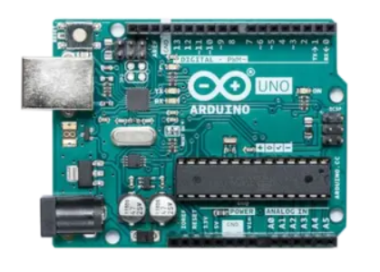
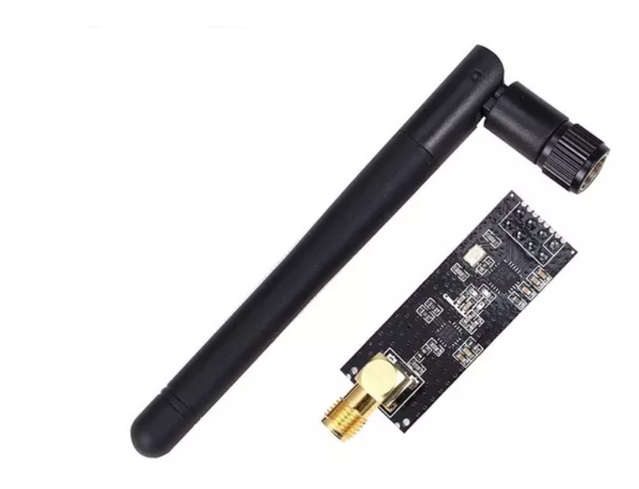
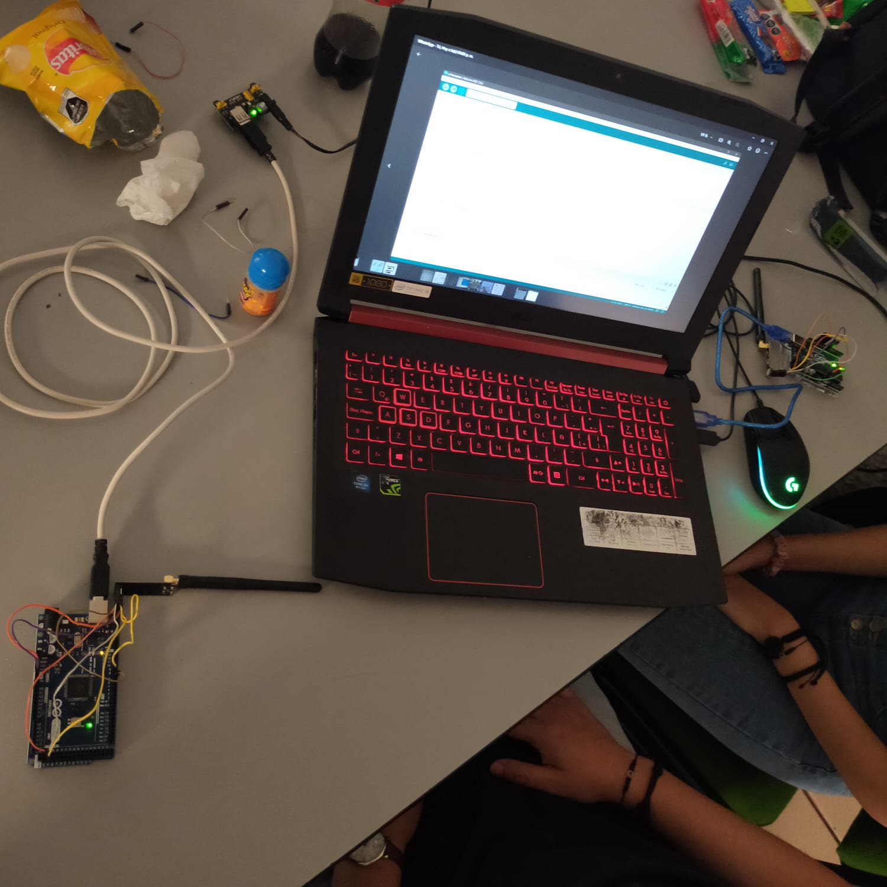

# Introducción 📖
Se propone realizar un programa que envíe una señal portadora usando un Arduino UNO y el modulo NRF24L01.

## ¿Qué es Arduino? 🤷‍♂️🤷‍

 
    <a href="https://arduino.cl/que-es-arduino/">Arduino</a> es una plataforma de desarrollo basada en una placa electrónica de hardware libre que incorpora un microcontrolador re-programable y una serie de pines hembra. Estos permiten establecer conexiones entre el microcontrolador y los diferentes sensores y actuadores de una manera muy sencilla (principalmente con cables dupont). 

## ¿Qué es el NRF24L01?🤷‍🤷‍♂️

    El NRF24L01 es un pequeño transceptor inalámbrico de muy bajo consumo y muy fácil de utilizar que funciona en el rango de los 2.4 GHz. Puede enviar y recibir datos pero no puede hacerlo al mismo tiempo. Esto hace que se abarate su coste y su funcionamiento sea muy sencillo y robusto. Puedes utilizarlo en cualquier proyecto que necesite enviar y/o recibir datos de forma inalámbrica sin complicaciones. Lo ideal es tener una pareja y hacer un enlace completo. Es totalmente compatible con Arduino.

**Caracteristicas:**
* Chip NRF24L01
* Frecuencia: ISM 2.4 GHz
* Modulación: GFSK con control de ganancia automática
* Control de datos: SPI
* Velocidad: 250kbps, 1Mbps y 2Mbps (configurable)
* Alimentación: 1.9V a 3.6V
* Consumo:  Transmisión: 11.3mA, recepción: 13.5mA @ 2Mbps 900nA en power down y 26uA en standby. 
* Pin IRQ de interrupción para recepción

## Explicación del código 💻👨‍💻

### Transmisor 📡
Se utilizan las bibliotecas SPI, <a href="https://github.com/nRF24/RF24/blob/master/nRF24L01.h">nRF24L01</a> y <a href="https://github.com/nRF24/RF24/blob/master/RF24.h">RF24</a>. Primero se crea un objeto RF24 llamado **radio** con los pines CE y CSN configurados como pines 9 y 10 respectivamente.

Luego se define una matriz de direcciones addresses para los nodos de la red. En este caso, solo se está utilizando un nodo, por lo que la dirección del nodo emisor es **addresses[1]**.

En la función **setup()**, se inicializa la comunicación de radio y se configuran los parámetros de transmisión, como el canal de radio, la potencia de transmisión, la tasa de datos y el número de reintentos.

En la función **loop()**, se envía una señal de portadora con la cadena "PORTADORA" a través de la radio utilizando el método **writeFast()**. Se espera un segundo entre cada transmisión.

La función **writeFast()** se utiliza para enviar datos rápidamente sin esperar confirmación de recepción. En este caso, como no se espera confirmación de recepción, no es necesario incluir un bucle de espera para esperar la respuesta del receptor.

El segundo argumento de **writeFast()** es la longitud del paquete que se va a enviar. En este caso, la longitud es de 9 bytes porque la cadena de texto "PORTADORA" tiene 9 caracteres.

Después de enviar la señal de portadora, el programa espera un segundo utilizando la función **delay(1000)**. Esto se hace para evitar que el programa envíe señales de portadora de manera demasiado rápida y para que el receptor tenga tiempo suficiente para procesar la señal antes de recibir la siguiente.

### Receptor 📻
Al igual que en el transmisor, el receptor utiliza las bibliotecas SPI, <a href="https://github.com/nRF24/RF24/blob/master/nRF24L01.h">nRF24L01</a> y <a href="https://github.com/nRF24/RF24/blob/master/RF24.h">RF24</a>. Creamos un objeto RF24 llamado radio con los pines CE y CSN configurados como pines 9 y 10 respectivamente.

Luego se define una matriz de direcciones addresses para los nodos de la red. En este caso, solo se está utilizando un nodo, por lo que la dirección del nodo receptor es **addresses[1]**.

En la función **setup()**, se inicializa la comunicación de radio y se configuran los parámetros de recepción, como el canal de radio, la potencia de recepción, la tasa de datos y el número de reintentos. También se abre un conducto de lectura para recibir los datos enviados por el emisor.

En la función **loop()**, se verifica si hay datos disponibles para leer utilizando la función **available()** de la biblioteca RF24. Si hay datos disponibles, se leen los datos utilizando la función **read()** y se imprimen en el puerto serie utilizando **Serial.println()**.

## Resultados 🧪⚗👩‍🔬👨‍🔬
Fue necesario usar un Transmisor y un Receptor con el fin de comprobar la funcionalidad del código, como se muestra en la siguiente imagen

**NOTA**.- Es importente que el modulo NRF24L01 reciva un voltaje de 3.3V, de lo contrario es muy probable que el modulo sufra algun daño

<a href="https://github.com/ArturoEmmanuelToledoAguado/Portadora-sin-modular-P1-antenas-">Código</a>
<a href="https://github.com/nRF24/RF24">Librerias</a>